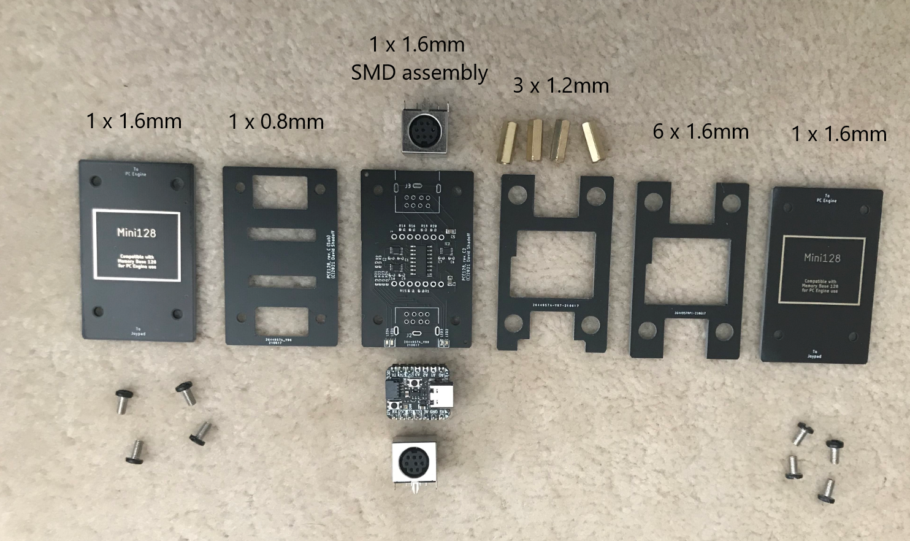
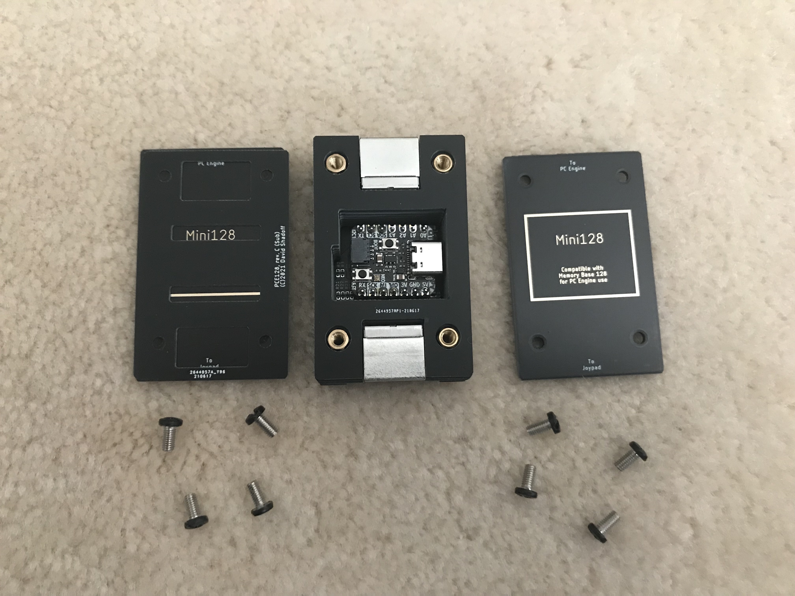

# PC_Engine_RP2040_Projects - Memory Base 128 reimplementation

## Overview

This is the third implementation of the Memory Base 128 I have written for modern hardware, and the easiest code to read/follow.
The PIOs on the Raspberry Pi Pico microcontroller are used for edge-sensing of the data input, and the ARM core is used for processing.

The data is loaded into SRAM at startup, and saved into Flash after transactions take place.  This may not be ideal, as the
device is not capable of processing additional commands while the Flash flush is in progress (it takes place 0.75 seconds
after the last read/write of a group of read or write transactions).  While this flush is taking place, the PIO state machine
is shut down, so there won't be a backlog of bits causing confusion; however, if any transactions take place during the period of
flash write, they won't be recognized, and the PC Engine game may identify an error.

## Source Code

This was built using Pico-SDK version 1.2.0
pico_sdk_import.cmake is from the SDK, but is required by CMake (and thus replicated here)

To build the source, first ensure that you have the right version of the RaspberryPi/piso-sdk installed.
As this board targets the Adafruit QtPy2040 board, you should run the make_ada.sh script (under UNIX), or from
the command-line, "cmake -DPICO_BOARD=adafruit_qtpy_rp2040 -B build"
Then, "cd build" and "make".

I have also included a release version of the program as a uf2 file in the releases/ folder; just drag and drop it
onto the virtual drive presented when putting the board into BOOTSEL mode (holding the 'boot' button, connect the
board by USB to a host computer, and release the button; a new drive should appear on the computer).

## PC Board & Assembly

I designed all boards using the free version of EAGLE (2-layer, less than 100mm on both X- and Y- axes).
The gerbers are included in this repository, in case you want to get your own set made.

I have included the gerbers and relevant bom.csv and assembly.csv files to get these boards
assembled by JLCPCB, but you will still need the following parts:
- (2) 8-pin Mini-DIN connectors
- (1) Adafruit QtPy RP2040 microcontroller board
- (2) 7-pin headers.  You may also want to use female pin header sockets in case you need to remove the microcontroller board.
I recommend using short/low-profile header sockets in this case.

You will also need some mounting hardware for the board stack-up:
- (4) M3 x 13mm female-female standoffs; flat side-to-flat side should be no larger tha 5.0mm, as the mounting holes are made for this size.  (4.5mm are fine too)
- (8) M3 screws, 6mm in length (*) - these may need to be longer if you don't trim the through-hole leads flush to the board.
- optional rubber/silicone feet

And for use, you will also need a short 8-pin mini-DIN male-male cable (various lengths can be found on ebay).

### Assembly

The "case" is made up of stacked PC boards, with PC boards on the top and bottom; There are 5 different boards in all, but 13 layers as follows:
a) Top = 1 layer, 1.6mm thick, ENIG board, in "PCE128_Rev_C_Face"
b) MidTop = 6 layers, 1.6mm thick, HASL board in "PCE128_Rev_C_MidTop"
c) MidLow = 3 layers, 1.2mm thick, HASL board in "PCE128_Rev_C_MidLow" (looks similar to MidTop, but has cutouts for the LEDs)
d) Main Board = 1 layer, 1.6mm thick, HASL, SMD assembly board in "PCE128_Rev_C2_Main" (Note: some parts have been shifted from the previous "B" version; they are not interchangeable)
e) Sub = 1 layer, 0.8mm thick (*), HASL board in "PCE128_Rev_C_Sub"
f) Bottom = 1 layer, 1.6mm thick, ENIG board in "PCE128_Rev_C_Face" (reverse side faces out)

(*) Note that I trim the through-hole leads flush to the board, which enables a thin "Sub" layer, which exists only to make space for the through-hole portions; if you do not trim these flush, you may need a much thicker Sub layer, and longer M3 screws.

Steps to assembly:
1) Trim the leads of the through-hole parts carefully, to minimize the solder "bump" on the underside of the board when mounted.  The through-hole parts to be mounted include the 8-pin mini-DIN sockets, and the headers (or sockets) for the RP2040 board.  **Make sure that the mini-DIN connectors are mounted straight, or the upper-layer boards may have trouble being placed.**
2) Solder carefully, miniizing the amount of "bump" below the board
3) With the LEDs closest to you, mount the RP2040 board with the USB connector on the right side
4) Connect it to a host computer while holding the "Boot" button down.  This will put it in DFU mode and create a virtual drive on the host computer.  Drag and drop the *.uf2 firmware file into that folder.  A moment later, the virtual drive should disappear and after about 1 second, all four LEDs should light up briefly as part of the boot sequence of the memory device.  Disconnect it from USB.

For the board stack-up, it is best to connect the lower boards first, with the screws going through the bottom layers of board, into one side of the female-female standoffs.  Then, the upper layer boards can simply be stacked, and the top screws tightened easily.

Here is a visual view:

## Notes
I have tried to use the Adafruit QtPy RP2040 as much as possible, as it is a compact form factor which is easy to design around.

Unfortunately, the Adafruit site tries to direct all users toward CircuitPython rather than the Pi SDK, and
as a result, Pinout pages of the "Pinout" page for their RP2040 devices don't include references to the GPIO numbers.

Therefore, I am including a graphic here:

