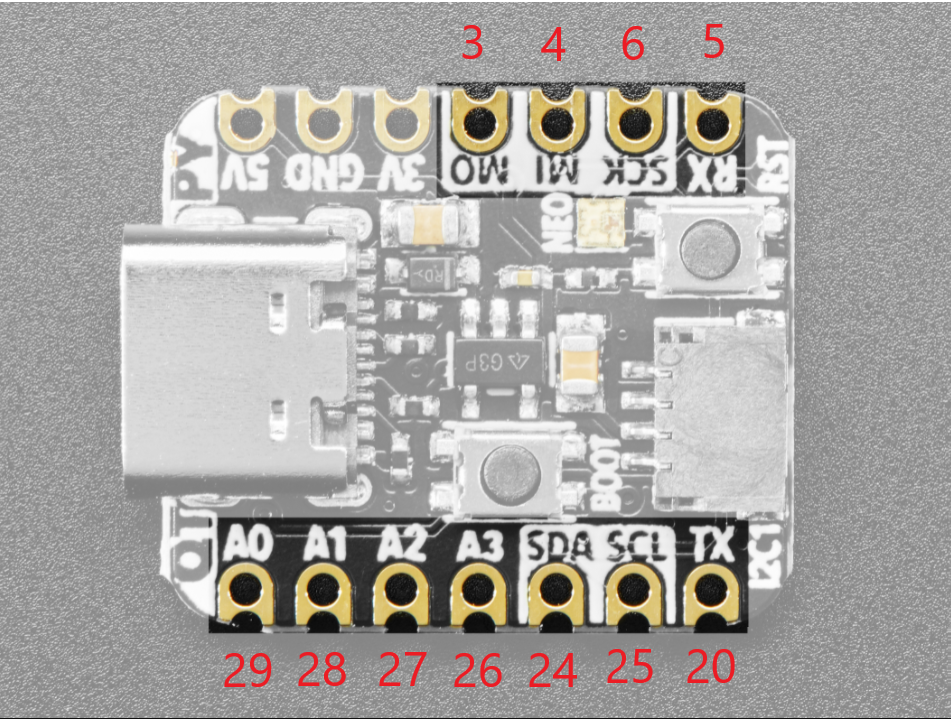

# PC_Engine_RP2040_Projects - Projects designed for PC Engine, using RPi Pico or other RP2040 hardware

## Memory Base 128 reimplementation

This is the third implementation of the Memory Base 128 I have written for modern hardware, and the easiest code to read.
The PIOs areused for edge-sensing of the data input, and the ARM core is used for processing.

The data is loaded into SRAM at startup, and saved into Flash after transactions take place.  This may not be ideal, as the
device is not capable of processing additional commands while the Flash flush is in progress (it takes place 0.75 seconds
after the last read/write of a group of read or write transactions).

## Others

Other Projects are coming... the PIOs on the RPi Pico are very interesting and flexible, so will be well-suited to
retrocomputing/retrogaming projects.

## Notes
I have tried to use the Adafruit QtPy RP2040 as much as possible, as it is a compact form factor which is easy to design around.

Unfortunately, the Adafruit site tries to direct all users toward CircuitPython rather than C/C++ (the Pi SDK), and
as a result, Pinout pages of the "Pinout" page for their RP2040 devices don't include references to the GPIO numbers.

Therefore, I am including a graphic here:

